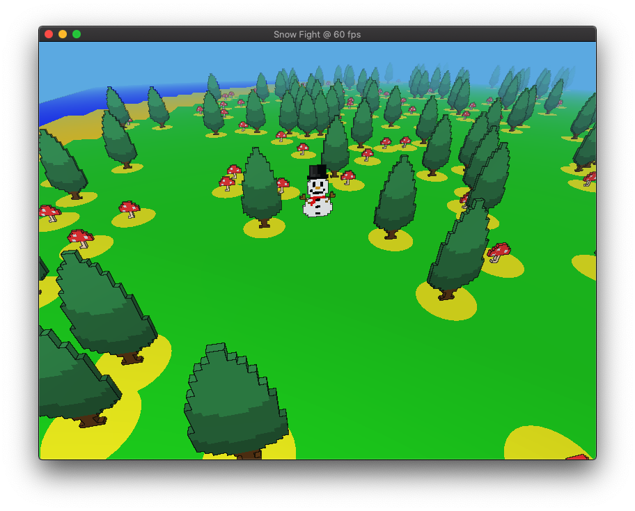

# Snow Fight

In this game, the snowmen throw you!

Snow Fight is an online multiplayer game written entirely (read, mostly) in
Rust. Communication between the clients and server use a entirely (read,
completely) custom network protocol built on top of UDP sockets.


## The network protocol

Network packets are encoded using a custom built bit-packing scheme that heavily
relies on variable length integers. This scheme is named `rabbit`, derived from
its small messages and fast (en|de)coding speed. Using the API is a joy due to
the declarative interface it provides:

```rust
/// Allows the struct to be written to a bit stream, uses anywhere from 20 to 68 bits.
#[derive(PackBits, UnpackBits)]
pub struct Point {
    x: i32,
    y: i32,
}

/// Also works on enums.
#[derive(Debug, Clone, PackBits, UnpackBits, From)]
pub enum ActionKind {
    Break(Break),
    Throw(Throw),
    Move(Move),
}

/* ... */
```


## Graphics Powered by WebGPU

Although graphics was not the focus for this project, it also uses the 
experimental WebGPU graphics standard. However, despite its name, Snow Fight
does not currently run on the Web. Instead it uses the
[wpgu-rs](https://github.com/gfx-rs/wgpu-rs) crate, which provides a WebGPU
compatible interface to native graphics APIs such as Vulkan, Metal, and DirectX.


## ECS

The primary game logic uses an Entity Component System (ECS) provided by the
[legion](https://github.com/TomGillen/legion) crate.


## Gallery



